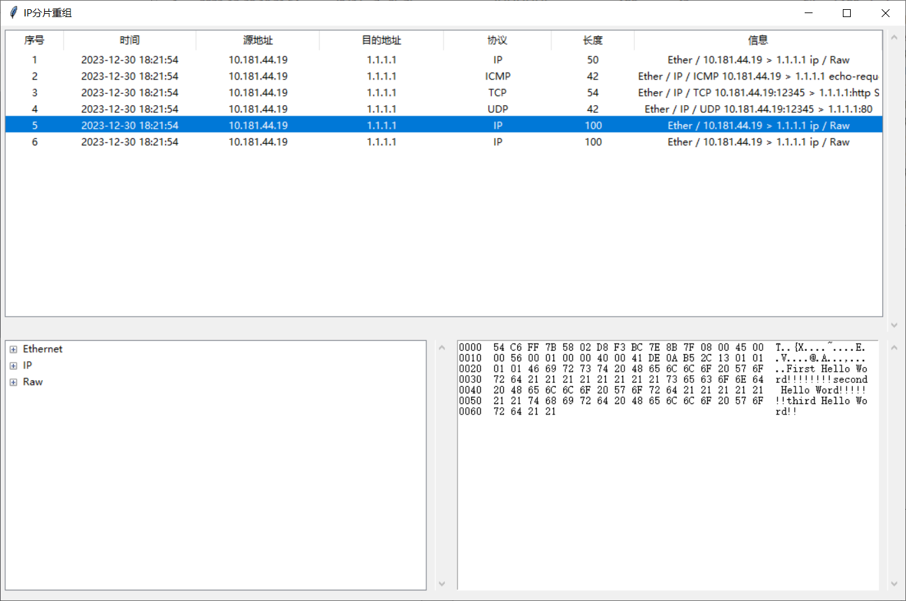
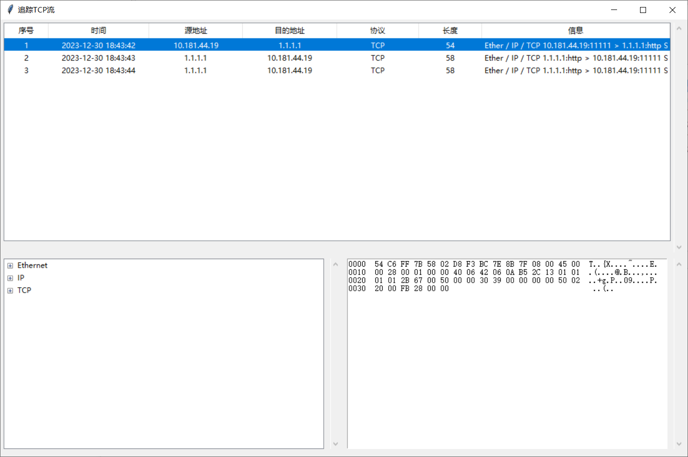
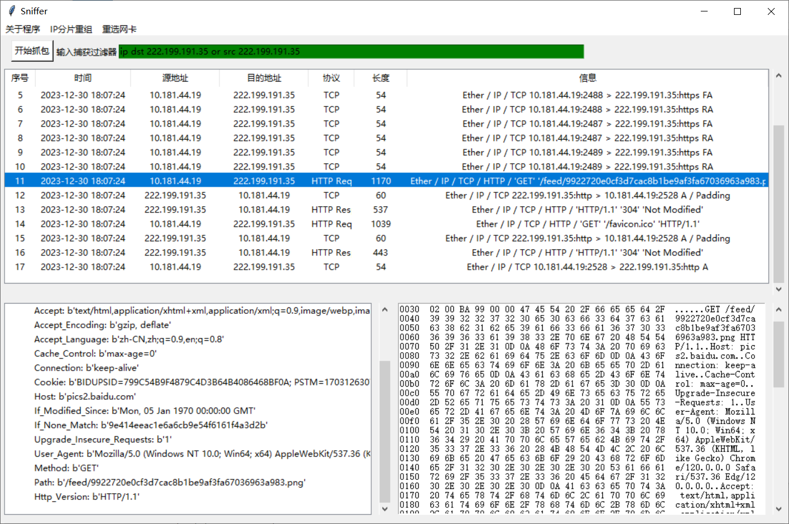

# Traffic Sniffer
 一个Python实现的网络嗅探器

《计算机通信网络》课程大作业

## 运行

安装`scapy==2.5.0`后，运行`python main.py`即可

## 功能

1. 网络抓包
2. 捕获过滤器过滤（tcpdump语法）
3. IP分片重组（仅支持IPv4）
4. 追踪TCP流（根据五元组分类）
5. 协议分层、16进制查看

## 运行图片

